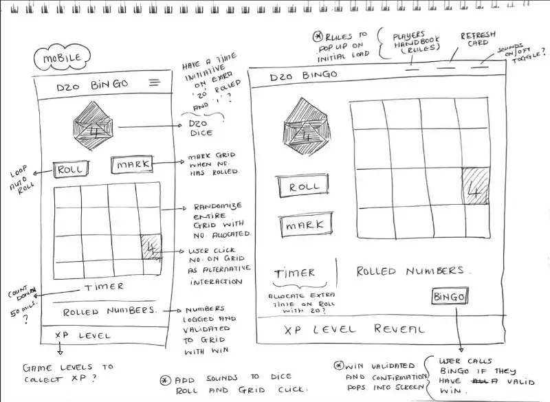
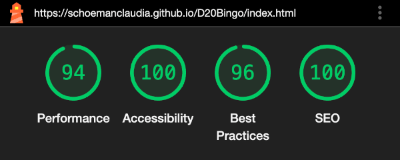
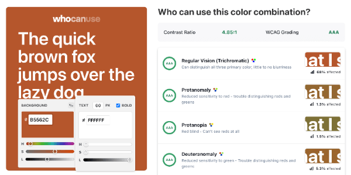
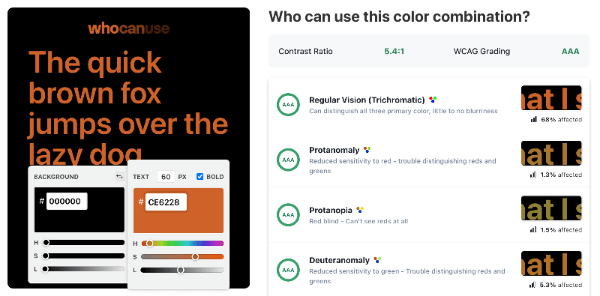
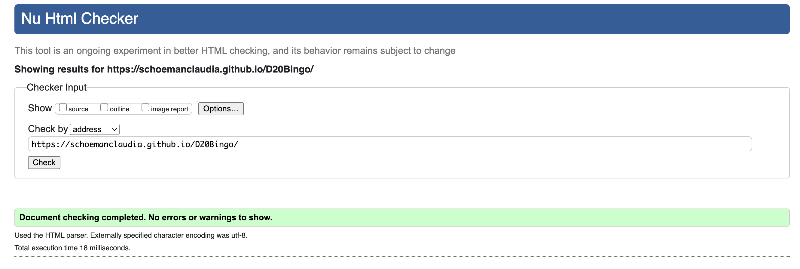
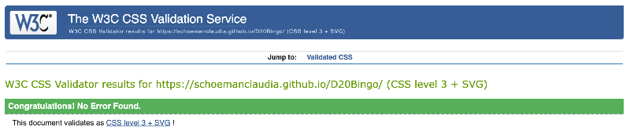
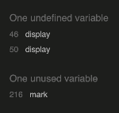
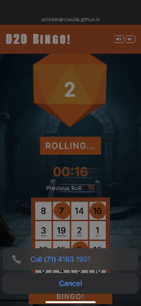
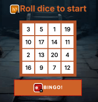
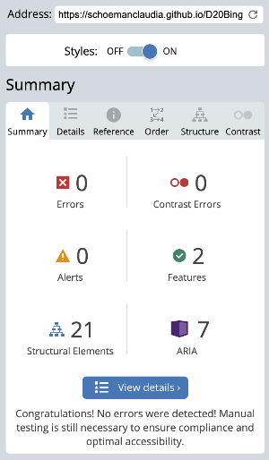

# D20 Bingo!

Not your casual neighbourhood bingo... D20 Bingo! is a game of chance, with a twist on the classic bingo. Combining bingo mechanics with the unpredictability of a 20 sided die, the user will race against the clock in this solo adventure. The goal is to complete a pattern on a 4x4 game card, with each number determined by the roll of a D20. 

Originally created with an RPG game in mind and opting for simplicity, I decided to create a basic dice game using a D20. However, soon realising the game lacked depth. I found myself thinking one rainy weekend, 'What would it be like to start playing Bingo in my 30s?'. While researching bingo games online, the inspiration struck to merge these concepts, blending the excitement of a D20 roll with the familiarity of bingo. Thus, D20 Bingo! was born.

Live Link: https://schoemanclaudia.github.io/D20Bingo/

## Game Scope

### Overview

- D20 Bingo! is a solo game where the unpredictability of a 20-sided die determines the marking of a 4x4 game card. The dice might roll the same number twice, three or maybe even four times during game play, which starts to make the game interesting when special rolls are introduced. Players race against the clock to complete patterns on their bingo cards, each number determined by the roll of a D20. This blend of luck and strategy offers a unique and thrilling experience for solitary play.
Created for a unique and enjoyable gaming experience for all ages, by blending the thrill of D20 dice rolls with the classic fun of bingo. It's simple and engaging mechanics make it perfect for solo play, providing a challenging and entertaining way to test your luck and strategy skills.

### Objectives

- Create a fast-paced, engaging game suitable for solo play.
- Merge elements of unpredictable dice rolling and bingo to create a unique gameplay experience.
- Design the game to be accessible and enjoyable for players of all ages.

### Core Mechanics

__Game Setup & Components:__
- Sound: Set to auto.mute on page load, buttons located in header.
- Rules: Give more information on gameplay within a modal, to not take up space within gameplay area.
- D20 Die: A standard 20-sided die used for rolling.
- Roll CTA: D20 and timer is activated by on click of button.
- Countdown: Timer counting down from 00:45, player aims to achieve bingo as fast as possible.
- Previous Roll: Displays previous die roll number.
- Bingo Grid: Randomised 4x4 grid card containing numbers 1 to 20, randomly distributed.
- Marker: Digital dabber for player to mark their card on click.
- Bingo button located below game card to call validation.
- Message panel which give feedback to player during gameplay.

__Game Play__
- The player rolls a D20 die on first roll, thereafter it rolls automatically for duration of game.
- The number rolled is marked on the bingo card if it is present.
- The goal is to complete a specific pattern on the card as quickly as possible.
- Special rolls are included to keep the game interesting:
  - 20 = Saving Throw: Adds 10 seconds to timer.
  - 1 = Death Throw: Subtracts 10 seconds from timer.

__Winning the Game:__
- The player wins by completing a row, column, diagonal, on the bingo grid.
- If the timer reaches 00:00 the game ends and player loses.

__Design Considerations:__
- Replayability: Ensure high replayability by varying the number distribution on the bingo grid and introducing randomised cards every game.
- Accessibility: Include clear instructions and simple rules to make the game easy to understand and play.
- Solo Play: Optimize the game mechanics for an engaging solo play experience.

### Development Plan

__Prototype Development:__
- Created initial prototype of bingo grid and test basic gameplay mechanics.
- Conducted solo playtesting sessions to gather feedback and refine rules.

__Design & Layout:__
- Appealing visual designs for game theme and components.
- Ensure site theme is consistently reflected throughout game play.

## Features 

### Existing Features

__Header__
  - Header sets the main rust colour theme, and styled to stay within screen view at all times
  - The site logo was created using font [Archivo Black](https://fonts.google.com/specimen/Archivo+Black) 
  - Sound buttons top right are always visible 

 

__About Game & Rules__
  -  Modal added to reduce space within the game play area on screen.
  -  Hover added on desktop to prompt button functionality.

 

__D20 Dice Roll__
  - Dice image was inspired by the classic D20, which acts as the main feature alongside the bingo card.
  - The dice is set to roll automatically on first activation of roll button, and animates a roll action every 3 seconds.

__Countdown Timer__
  - Countdown panel prompts for dice roll, which activates timer on game start.
  - The countdown timer starts at 00:45.
  - If the timer runs out then the display will indicate 00:00
  - The timer adjusts when a special roll is activated, a 20 or 1.

  

 __Previous Roll Panel__
  - This is introduced to assist the player with recall of the previous dice roll.
  - With game play at a fast pace and keeping dice rolling every 3 seconds, player needs to keep track or they will miss a number.
  - By only previewing the last dice roll and not all numbers rolled, allows for players to think quickly.

 

__Bingo Grid & Button__
  - A 4x4 card with a randomised number array added into a grid format.
  - The number array is setup to allow the card to refresh after every game, it keeps it random and to chance.
  - The bingo grid is only markable if the number has rolled.
  - If the number is missed and the timer runs out, no more marks can be actioned on grid.
  - The aim is to complete a row, column, or diagonal line of 4 numbers and then call bingo.
  - Bingo is called by on click of button, this validates the marked numbers on game card.
  - Only marked numbers are validate, if a number was rolled but missed, then no bingo given.
  - If no bingo is validated, the game continues and dice keeps rolling until time is up.

  

__Message Panel__
  - These are prompts displayed during game play to give feedback:
    - Bingo won
    - No bingo yet
    - Time is up
    - Saving Throw (+10 seconds to countdown)
    - Death Throw (-10 seconds from countdown)
  - If the messages are prompted during game play, they disappear with next dice roll to keep game flowing.

    

 __The Footer__ 
  - The footer section includes a link to a site called The Roarbots, which explains a brief history of the D20. The link will open to a new tab to allow easy navigation for the user. 

__404 Error Page__
  - A custom error page loads if incorrect url loads.
  - Button on page redirects back to home page.

 

### UX/UI Wireframing

- The site was developed with a mobile-first approach.
- Main colour theme hex for rust (#b5562c) and (#ce6228), secondary is standard white (#ffffff) and black (#000000).
- Wireframe drawn up pre-development to assist with structure of elements during gameplay. As development commenced, elements were adjusted for the best user experience.

### Future Features to Implement

- Create 'Experience Level' reveal panel:
- Allow player to collect tokens during various levels as they progress through bingo wins.
- Once full panel of tokens have been collected, the dungeon doors unlock and reveal a 'Monster Level'
- Monster Level will consist of a monster size bingo card to complete to win the ultimate battle.
- Introduce different game objectives within levels as player progresses through XP Levels, this will entail timer adjustments and game card validation to vary depending on bingo requirements for that level.

## Testing 

### Accessibility

-   Tested and confirmed that the site works in different browsers; Chrome, Safari and Firefox.
-   Tested and confirmed that all internal links are working 
-   Tested that all external links are working and opening in a separate tab.
-   Tested all gameplay functionality within these browsers and screen sizes.

- Ran the pages through Lighthouse, performance  level was 67 with initial load, but the sites accessibility above 90.
  - Fixed the performance on page initial load:
    - Modifying aspect ratio on all images used, by specifying exact sizes with space needed improved the CLS.
    - Adding styling for the previous roller number panel, by specifying the space needed avoids content shifting when panel appears on dice roll.
    - Modifying the message panel to the bottom of the bingo button, this eliminated the shifting of content when messages disappeared and re-appeared during gameplay.
    - Modifying the accordion sections for rules to a modal, this eliminated the large layout shifts when running lighhouse diagnostics.
  
  - After changing to a modal design and retesting, the sites performance and accessibility improved greatly at 90 and above.

- Tested colour contrast and its affect on different visual impairments via [WhoCanUse.com](https://www.whocanuse.com/)

 

## Technologies Used

### Languages

- HTML5
- CSS3
- JavaScript

### Other Sites and Software

- Image editing:
  - Dabber mark for grid marking, D20 and 404 die face images were edited with Adobe Creative Cloud software. The editing was done in Illustrator and Photoshop to create and make changes to elements to suit site branding and functionality.

- Image assets reduced with online platforms:
  - TinyPNG: https://tinypng.com/ 
  - XConvert: https://www.xconvert.com/

- Problem solving and video tutorials:
  - Show active button: https://www.reddit.com/r/twinegames/comments/tn4hhi/help_keeping_an_element_active_after_clicking_on/
  - Modal Rules Popup - https://www.w3schools.com/howto/howto_css_modals.asp
  - Dice Roll functionality: https://www.youtube.com/watch?v=UkmNL7eJqsU
  - Set the final dice img after animation: https://developer.mozilla.org/en-US/docs/Web/API/setTimeout
  - Dice loop pause time delay - https://developer.mozilla.org/en-US/docs/Web/API/setInterval
  - Countdown timer: https://stackoverflow.com/questions/20618355/how-to-write-a-countdown-timer-in-javascript
  - Validating bingo on marked grid: https://stackoverflow.com/questions/36840363/three-in-a-row-check-bingo and https://www.geeksforgeeks.org/create-a-bingo-game-using-javascript/

### Validator Testing 

- HTML
  - There was an errors when running html through [W3C HTML Validator](https://validator.w3.org/):
    - Stray closing tag for main section in body, by removing the extra closing tag the error was solved.
    - Within the 404.html there was a button element inside the anchor tag. The button redirects back to index.html, by removing the button element and placing href link back into anchor, the problem was solved.
  - After fixing above attributes, no errors found when running the code through the [W3C HTML Validator](https://validator.w3.org/)

- CSS
  - No errors were found when running the code through the [W3C CSS Validator](https://jigsaw.w3.org/css-validator/)

- JavaScript
  - There were 2 errors when running script through [JSHint](https://jshint.com/):
    - Undefined display variable, after declaring variable within js the error was corrected.
    - Unused mark variable, this needed some modification to the code that displays the uniqueNumbers to the bingo grid. After adjusting the html used to call on click within the forEach statement, the best solution was to then add a separate event listener to add on click to bingo grid. In turn this solved the error by calling mark(num) within the event listener.

  - After fixing above attributes, no errors were found when running the code through the [JSHint](https://jshint.com/)

### Bugs Encountered

- While testing the game play through on mobile, the random number array within the bingo grid would underline some of the integers within the grid. When the grid box is clicked to mark rolled number, the mobile device would recognise the array as a telephone number and prompt a call pop-up onto screen.
  - The CSS already specified no decoration on anchor tags within global styling, but after adding a meta tag within html that specifies the telephone format detection as =no, solved the problem when testing on mobile again.
- Low contrast error and possible heading warning when passing through the official [WAVE Web Accessibility Evaluation Tool](https://wave.webaim.org/)
  - Low contrast error was corrected by modifying the button background-color in styles to a darker shade for better visibility of button test.
  - Heading warning was corrected by modifying the html for timer message text from a paragraph to an h3 heading.

### Unfixed Bugs

-   No unfixed bugs, [WAVE Tool](https://wave.webaim.org/) returned with no errors.

## Deployment

### Version Control
-   The site was created using Gitpod editor and pushed to Github to the remote repository 'D20Bingo'.
-   Git commands were used throughout the development to push the code to the remote repository. The following git commands were used:
    -   git add . - to add the files to the staging area before being committed.
    -   git commit -m "commit message" - to commit changes to the local repository queue that are ready for the final step.
    -   git push - to push all committed code to the remote repository on Github.

### Deployment to Github Pages
-   The site was deployed to Github pages as follows:
    -   In the Github repository, navigate to Settings tab
    -   From the source section drop-down menu, select the Master branch and Save
    -   Once the Master branch was selected, the page provided the link to the website
- The site was deployed to GitHub pages, the live link can be found here: https://schoemanclaudia.github.io/D20Bingo/

### Cloning of the Repository Code locally
-   Go to the Github repository that you want to clone
-   Click on the Code button located above all the project files
-   Click on HTTPS and copy the repository link
-   Open the IDE of your choice and paste the copied git url into the IDE terminal
-   The project is now created as a local clone

## Credits 

- Slack channel learn-javascript peers, for assisting with adding a meta tag telephone=no to eliminate grid numbers that were recognised as phone number prompt when clicked on.
- Slack channel peer-code-review for their feedback and taking the time to look at D20 Bingo with fresh eyes.
- Shoutout to henna.s_5P for the support when it all seemed to become overwhelming, and all the extra tips during our chats.
- My mentor for the support and knowledge shared, which has been invaluable.
- Slack channel peers for breadcrumbs left to problem solve my own project, while testing and fixing bugs.

### Content 

- Fonts used for site content imported from [Google Fonts](https://fonts.google.com/)
  - Logo and main headings: [Archivo Black](https://fonts.google.com/specimen/Archivo+Black)
  - Body content: [Inter](https://fonts.google.com/specimen/Inter)
- The icons throughout site were taken from [Font Awesome](https://fontawesome.com/) 
- Game content was inspired by catch phrases used when playing the classic Dungeons and Dragons [Adobe Stock](https://stock.adobe.com/)  
- Background image is a licensed download from [Adobe Stock](https://stock.adobe.com/)

### Media Source Links

- Background music: https://pixabay.com/music/main-title-battle-of-the-dragons-8037/
- Dice roll sound effect: https://pixabay.com/sound-effects/rpg-dice-rolling-95182/
- Background image: https://stock.adobe.com/ie/images/underground-dungeon-fantasy-adventure-tabletop-role-play-game-setting-dark-and-creepy-background-created-with-generative-ai/766587031
- D20 and 404 dice face images, screenshots taken and backgrounds removed in Adobe CC: https://g.co/kgs/RjNcAcV
- Animate dice roll - https://learn.newmedia.dog/tutorials/p5-js/remainder/
