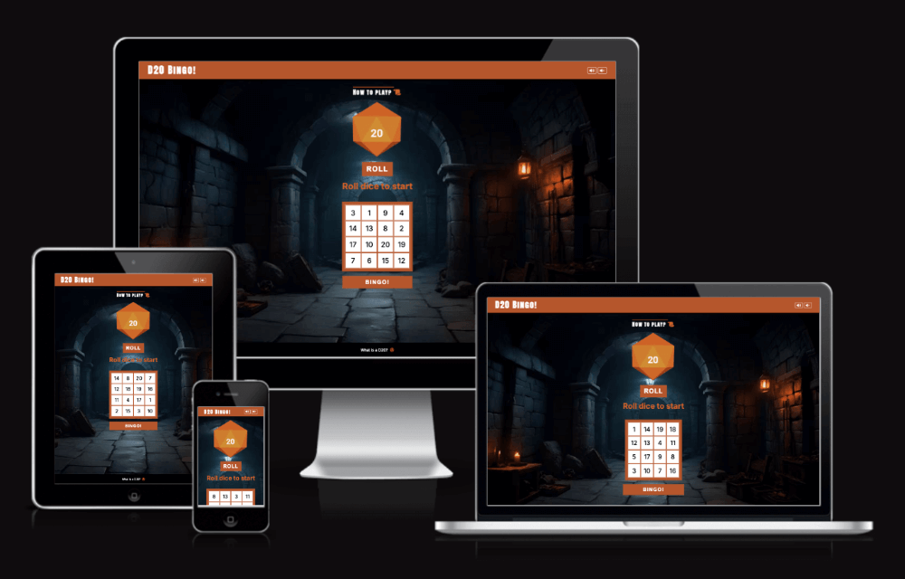

# D20 Bingo

D20 Bingo is a game of chance, with a twist on the classic bingo. Combining bingo mechanics with the unpredictability of a 20 sided die, the user will race against the clock in this solo adventure. The goal is to complete a pattern on a 4x4 game card, with each number determined by the roll of a D20. 

## Features 

### Existing Features

- __Header with sound buttons__

  - The site logo and emblem sets the main colour theme: 
  - 
  - 

- __About Game__

  -  
  -  

- __Game Rules__

  - 

- __D20 Dice Roll__

  - 
  - 

- __Message Panel__

  - 
  - 

- __Countdown Timer__

  - 
  - 

- __Previous Roll Panel__

  - 
  - 

- __Bingo Grid__

  - 
  - 

- __The Footer__ 

  - The footer section includes a link to a site called The Roarbots, which explains a brief history of the D20. The link will open to a new tab to allow easy navigation for the user. 

- __404 Error Page__

  - 
  - 

### UX/UI Wireframing

- The site was developed with a mobile-first approach.
- Main colour theme hex for rust (#) and (#).
- Wireframe drawn up pre-development to assist with structure of elements on each page, panels are based on mobile view. As development commenced, elements on pages were adjusted for the best user experience.

### Future Features to Implement

-  

- 

-  

## Testing 

### Accessibility

- Ran the pages through Lighthouse, performance with initial load passed, and the site is accessible.

- Tested color contrast and its affect on different visual impairments via [WhoCanUse.com](https://www.whocanuse.com/)

-   Tested and confirmed that the site works in different browsers; Chrome, Safari and Firefox.
-   Tested and confirmed that all internal links are working 
-   Tested that all external links are woking and opening in a separate tab.
-   

### Validator Testing 

- HTML
  - 
  - After fixing above attributes, no errors found when running the code through the [W3C HTML Validator](https://validator.w3.org/)

- CSS
  - 
  - After fixing above attributes, no errors found when running the code through the [W3C CSS Validator](https://jigsaw.w3.org/css-validator/)

### Bugs Encountered

- 
  - 

- 
  - passing through the official [WAVE Web Accessibility Evaluation Tool](https://wave.webaim.org/)
  - 

### Unfixed Bugs

-   No unfixed bugs, [WAVE Tool](https://wave.webaim.org/) returned with no errors.

## Deployment

### Version Control
-   The site was created using Gitpod editor and pushed to Github to the remote repository 'D20Bingo'.
-   Git commands were used throughout the development to push the code to the remote repository. The following git commands were used:
    -   git add . - to add the files to the staging area before being committed.
    -   git commit -m "commit message" - to commit changes to the local repository queue that are ready for the final step.
    -   git push - to push all committed code to the remote repository on Github.

### Deployment to Github Pages
-   The site was deployed to Github pages as follows:
    -   In the Github repository, navigate to Settings tab
    -   From the source section drop-down menu, select the Master branch and Save
    -   Once the Master branch was selected, the page provided the link to the website
- The site was deployed to GitHub pages, the live link can be found here: https://schoemanclaudia.github.io/D20Bingo/index.html

### Cloning of the Repository Code locally
-   Go to the Github repository that you want to clone
-   Click on the Code button located above all the project files
-   Click on HTTPS and copy the repository link
-   Open the IDE of your choice and and paste the copied git url into the IDE terminal
-   The project is now created as a local clone

## Credits 

- Slack channel peer-code-review participants for assisting with bug fix.
- My mentor for the support and knowledge shared.

### Content 

-   The icons throughout site were taken from [Font Awesome](https://fontawesome.com/)   
-   m [Adobe Stock](https://stock.adobe.com/). Creative Cloud software was used for the changes to elements to suit site branding.
-   

### Media

- 
